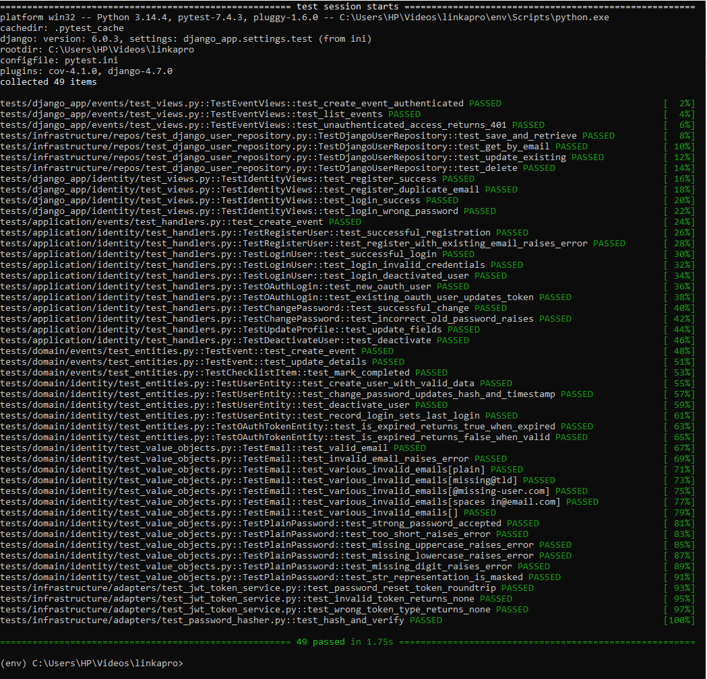

# Linkapro: Event Planning & Vendor Marketplace Platform

Linkapro is a production-grade backend system designed for the Rwandan and East African markets. It provides a robust ecosystem for Event Planners to organize events and Service Vendors to showcase their offerings.

## 🚀 Features

- **Identity & Access**: Secure role-based authentication (Planner, Vendor, Admin), Google OAuth2 integration, and JWT session management.
- **Event Management**: Comprehensive workspaces for checklists, budget tracking, guest lists (RSVP/Table assignments), and drag-and-drop timelines.
- **Vendor Portal**: Business profile management, portfolio galleries (via Cloudinary), and service package configuration.
- **Marketplace**: High-performance search and discovery engine powered by FastAPI, featuring verified reviews and ratings.
- **Document Engine**: Server-side PDF (WeasyPrint) and Excel (OpenPyXL) generation for event briefs and guest lists.
- **Governance**: Dedicated administration dashboard for vendor approval, content moderation, and platform analytics.

## 🏗️ Architecture

The project follows a strict **Three-Layer Architecture** to ensure separation of concerns:
1. **Domain Layer**: Pure Python entities, value objects, and repository interfaces.
2. **Application Layer**: Use cases, command/query handlers, and DTOs.
3. **Infrastructure Layer**: Framework-specific implementations (Django/FastAPI), concrete repositories, and external adapters.

## 🛠️ Tech Stack

- **Backend**: Django 5 (DRF) & FastAPI (Async search).
- **Database**: PostgreSQL 16 with `pg_trgm` for full-text search.
- **Task Queue**: Celery + Redis for background processing.
- **Storage/Mail**: Cloudinary (Images), SendGrid (Email).
- **DevOps**: Docker & Nginx.

## 📂 Project Structure

```text
evplan/
├── domain/         # Core business logic (Entities, Interfaces)
├── application/    # Use case orchestration (Handlers, DTOs)
├── django_app/     # Django configuration, Admin, and CRUD
├── fastapi_app/    # High-performance Marketplace endpoints
├── infrastructure/ # DB Repositories and external service adapters
└── tasks/          # Celery background tasks
```

## 🧪 Test Evidence

Below is the current status of the test suite execution:

!Test Execution Results
