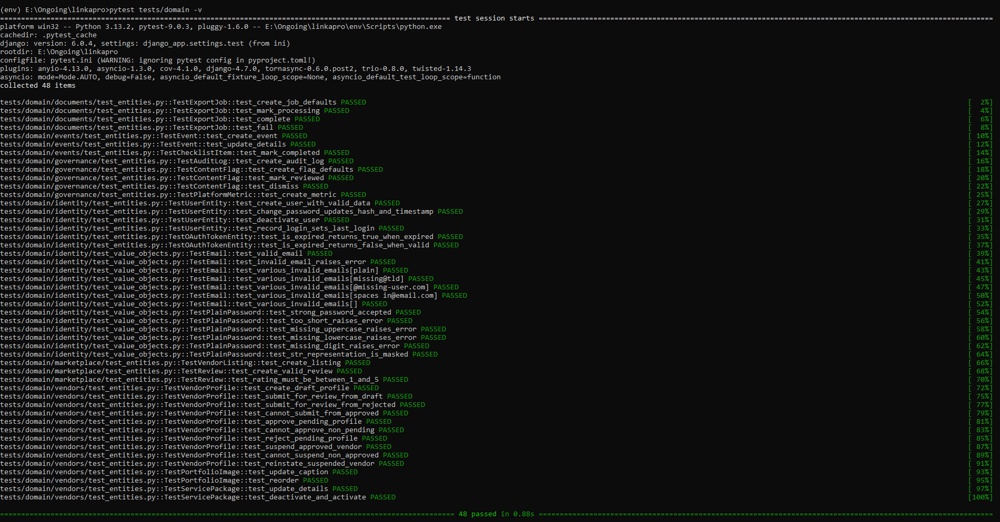
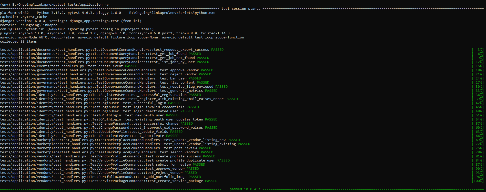
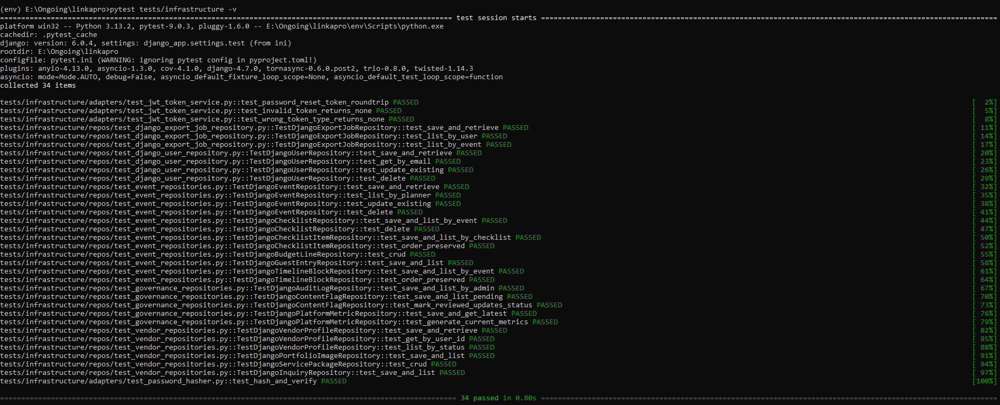
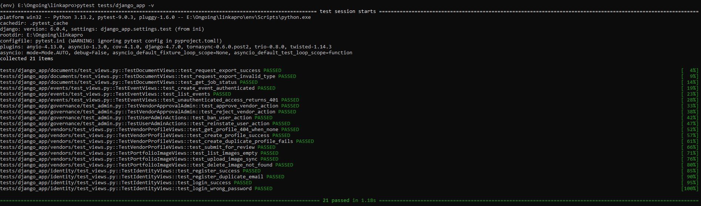
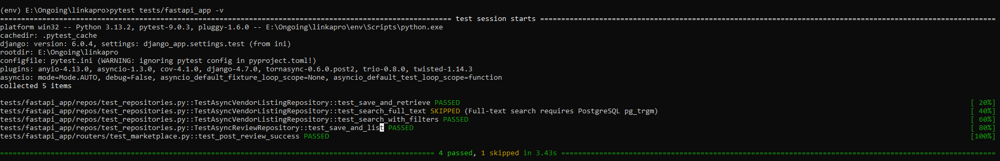
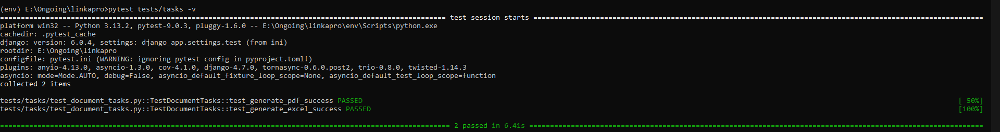

<div align="center">
  <h1>Linkapro</h1>
  <h3>Event Planning & Vendor Marketplace Backend</h3>
  <p>
    
    
    
    
    
    
    
  </p>
</div>

---

## 📖 Table of Contents

- [1. Overview](#-overview)
- [2. Key Features](#-key-features-application-capabilities)
- [3. System Architecture](#-system-architecture)
- [4. Technology Stack](#-technology-stack)
- [5. Project Structure & Deep Dive](#-project-structure--component-deep-dive)
- [6. Getting Started](#-getting-started)
- [7. Testing Strategy](#-running-tests)
- [8. Troubleshooting](#-troubleshooting)
- [9. Test Evidence & Verification](#-test-evidence--verification)
<!-- - [11. Deployment Architecture](#-deployment-architecture) -->

---

## 📋 Overview

**Linkapro** is a domain-driven, layered backend system designed to manage event planning workflows and vendor marketplace interactions with strict separation of concerns and scalable architecture.

The system models three primary bounded actors:

- **Event Planners** — create and manage event lifecycles including budgeting, scheduling, guest coordination, and vendor selection.
- **Service Vendors** — expose structured service offerings through portfolios, pricing models, and availability management.
- **System Administrators** — enforce governance through moderation, approvals, auditability, and operational control.

Linkapro is not a monolithic application layer; it is structured around independent domains that communicate through well-defined application services and infrastructure adapters.

Core design constraints:
- Business rules are isolated within the Domain layer
- Application layer orchestrates workflows without owning rules
- Infrastructure is replaceable and framework-bound (Django, FastAPI, Celery)
- All external integrations are abstracted behind ports

---

## ✨ Key Features (Application Capabilities)

### 🔐 Identity & Access Domain
- Authentication via email/password and social OAuth2 (Google)
- Role-based access control (Event Planner / Vendor / Admin)
- Hardened JWT management with **Refresh Token Rotation**, **Family-based Blacklisting**, and **Step-up Authentication** for sensitive actions.
- **TOTP-based 2FA** (Two-Factor Authentication) for enhanced account security.
- Profile lifecycle management (update, recovery, reset)

---

### 📋 Event Management Domain
- Event lifecycle orchestration (create → plan → execute)
- Budget tracking (estimated vs actual per category)
- Task/checklist engine with due dates and status transitions
- Guest management with RSVP and metadata tracking
- Event timeline modeling and scheduling logic

---

### 📸 Vendor Management Domain
- Vendor profile aggregation (bio, category, service scope)
- Portfolio media management (upload, ordering, metadata)
- Pricing model definitions (packages and tiers)
- Vendor approval workflow via governance layer

---

### 🛒 Marketplace & Discovery (Read-Optimized Domain)
- Full-text search with multi-criteria filtering
- Public vendor exposure layer (read-only projection)
- Rating and review aggregation model
- Inquiry submission system with validation layer

---
### 💳 Payments & Financial Domain
- Secure one-time payments via **Flutterwave Standard v3**.
- Support for Mobile Money (MTN, Airtel, M-Pesa), Cards, and Bank Transfers.
- **Race condition protection** via Redis distributed locking.
- Idempotent webhook processing and strict domain-driven state machine.
- **JWE (JSON Web Encryption)** for secure request/response payloads using `jwcrypto`.
- Multi-currency support (RWF, USD, EUR, KES, GHS, NGN).

---

### 📄 Document Generation Domain
- Server-side PDF generation for event reports (WeasyPrint)
- Spreadsheet exports for budgets and guest lists (OpenPyXL)
- Template-based document rendering system
- Asynchronous generation via background workers (Celery)

---

### 🛡️ Governance & Administration Domain
- Administrative control plane (Django Admin)
- Vendor approval and rejection pipeline
- User lifecycle enforcement (ban, suspend, reinstate)
- Audit logging and system traceability
- Platform-level analytics and monitoring views

---

## 🏗️ System Architecture

Linkapro is designed using a **strict layered architecture** with enforced dependency direction and clear separation of concerns. The system follows a **unidirectional flow model** to ensure testability, scalability, and framework independence.

---

### 🧠 1. Domain Layer (Core Business Rules)

The Domain Layer is completely framework-agnostic and contains the system’s business intelligence.

It includes:
- Entities
- Value Objects
- Domain Services
- Repository Interfaces
- Domain Events

**Rules:**
- No Django / FastAPI / external library dependencies
- No database access
- No HTTP or infrastructure concerns
- Defines *what the system is*, not *how it runs*

---

### ⚙️ 2. Application Layer (Use Case Orchestration)

The Application Layer coordinates business workflows without owning business rules.

It includes:
- Commands
- Queries
- Handlers / Use Cases
- DTOs (Data Transfer Objects)

**Responsibilities:**
- Executes domain logic in correct order
- Manages transaction boundaries
- Publishes domain events
- Transforms domain models into response structures

**Rules:**
- No direct database access
- No framework-specific logic
- Depends only on Domain Layer

---

### 🔌 3. Infrastructure & Interface Layer

This layer provides all external system integrations and framework implementations.

It includes:
- Django ORM repositories
- FastAPI routes/controllers
- Celery workers
- External services (Cloudinary, SendGrid, WeasyPrint)

**Responsibilities:**
- Implements repository interfaces
- Handles HTTP requests/responses
- Manages external API communication
- Executes background jobs

**Rules:**
- Can depend on Application + Domain
- Must NOT contain business rules
- Fully replaceable without affecting core logic

---

## 🔁 Dependency Rule (Strict Constraint)

---

Infrastructure → Application → Domain

---

### 🧩 Bounded Contexts

Linkapro is decomposed into independent bounded contexts, each representing a cohesive business capability with clear ownership and isolation.

---

| Context              | Core Responsibility (Domain Scope)                         | Primary Interface Layer |
|----------------------|------------------------------------------------------------|-------------------------|
| Identity & Access    | Authentication, authorization, user lifecycle, roles       | Django                  |
| Event Management     | Event lifecycle, planning workflows, budgeting, scheduling | Django                  |
| Vendor Management    | Vendor identity, portfolios, services, availability        | Django                  |
| Marketplace          | Search, discovery, ranking, public projections             | FastAPI                 |
| Document Generation  | Report generation, exports, document rendering pipelines   | Celery Workers          |
| Payments             | Transaction lifecycle, webhooks, provider reconciliation   | Django + Flutterwave    |
| Governance           | System moderation, approvals, auditability, analytics      | Django Admin            |

---

## 🛠️ Technology Stack

The technology stack is organized by **system responsibility layers**. Each component exists to support a specific architectural concern.

---

### ⚙️ Interface Layer (Web & API Delivery)
- Django (Core application framework, admin interface, API orchestration)
- FastAPI (High-performance read API / marketplace queries)

---

### 🧠 Domain Support Layer (State & Workflow)
- PostgreSQL (Primary relational data store)
- Redis (Caching, session state, background coordination)

---

### ⚙️ Asynchronous Processing Layer
- Celery (Background job orchestration)
- Redis Broker (Task queue transport layer)

---

### 🧱 Infrastructure Layer (Deployment & Isolation)
- Docker (Containerized execution environment)
- Docker Compose (Multi-service orchestration)

---

### 🌐 External Integration Layer
- Cloudinary (Media storage and delivery)
- Google OAuth (Authentication provider integration)
- SendGrid (Transactional email delivery system)

---

### 📄 Document Processing Layer
- WeasyPrint (PDF generation engine)
- OpenPyXL (Spreadsheet generation and export engine)

---

## 📂 Project Structure & Component Deep Dive

Linkapro follows a strict Clean Architecture pattern. Below is the complete project directory structure mapped out with the exact role and responsibility of each folder, subfolder, and file.

```
linkapro/
├── domain/                         # Layer 1: Core Bounded Contexts (Pure Python)
│   ├── identity/                   #   - Identity & Access Entities, Value Objects, Interfaces
│   ├── events/                     #   - Event, Checklist, Budget, Guest Entities & Interfaces
│   ├── vendors/                    #   - Vendor Profile, Portfolio, Packages Entities & Interfaces
│   ├── marketplace/                #   - Search, Review, Rating Entities & Interfaces
│   ├── documents/                  #   - ExportJob and Document Export Interfaces
│   ├── governance/                 #   - Content Flag, Audit Log, Platform Metric Interfaces
│   └── shared/                     #   - Shared domain utilities and dispatch interfaces
│
├── application/                    # Layer 2: Core Workflows (Commands, Queries, Handlers)
│   ├── identity/                   #   - Register/Login commands, TOTP and OAuth handlers, JWT/Session DTOs
│   ├── events/                     #   - CreateEvent, Checklist transitions, Budget & Guest trackers
│   ├── vendors/                    #   - Profile registration, portfolio uploading, package creations
│   ├── marketplace/                #   - Review submissions, discovery and search query orchestration
│   ├── documents/                  #   - Triggering PDF/Excel export commands and state handshakes
│   └── governance/                 #   - Moderation actions, vendor approvals, suspensions, analytics queries
│
├── payments/                       # Bounded Context: Payments (Self-contained DDD Slice)
│   ├── domain/                     #   - State machine, velocity policy, JWE encryption, webhook decrypters
│   ├── application/                #   - Initiate payment commands, webhook handlers, rotation commands, ports
│   ├── infrastructure/             #   - Flutterwave API adapters, Redis blacklists, Vault key providers, middleware
│   ├── helpers/                    #   - Payload structures, cryptographic utilities
│   └── tasks.py                    #   - Celery tasks for expiration and webhook retries
│
├── django_app/                     # Layer 3: Django Web Framework Interface (Commands & Operations)
│   ├── settings/                   #   - Settings configurations (base.py, test.py, production.py)
│   ├── identity/                   #   - Models, views, DRF serializers, custom cookies & OAuth state
│   ├── events/                     #   - Event dashboard views, Django serializers, model definitions
│   ├── vendors/                    #   - Vendor profile models, portfolio uploads, packages management views
│   ├── documents/                  #   - Export jobs model, download views, signal handlers
│   ├── governance/                 #   - Admin portal customizations, approval workflows
│   ├── payments/                   #   - Payment state database models, webhook ingress views
│   ├── common/                     #   - Shared views, base serializers, common middleware
│   ├── urls.py                     #   - Django main routing table
│   └── wsgi.py                     #   - WSGI application gate
│
├── fastapi_app/                    # Layer 3: FastAPI Web Framework Interface (Read/Search Optimization)
│   ├── marketplace/                #   - Marketplace SQLAlchemy models
│   ├── routers/                    #   - Async endpoints for search, vendor profiles, and reviews
│   ├── main.py                     #   - App initialization, router mounts, middleware registrations
│   ├── dependencies.py             #   - Depends() dependency injection factories
│   ├── database.py                 #   - Async SQLAlchemy session setup
│   ├── repositories.py             #   - Async repos (Vendor listing search, reviews)
│   └── schemas.py                  #   - Pydantic models for request validation/response serialization
│
├── infrastructure/                 # Layer 3: Concrete Shared Repositories and Adapters
│   ├── repos/                      #   - Django repositories implementing Domain interfaces
│   └── adapters/                   #   - Adapters (Cloudinary, SendGrid, JWTToken, Google OAuth)
│
├── tasks/                          # Layer 3: Celery Workers (Asynchronous tasks)
│   ├── celery.py                   #   - Celery application settings & config
│   ├── document_tasks.py           #   - PDF briefs (WeasyPrint) & Excel exports (OpenPyXL) tasks
│   ├── image_tasks.py              #   - Async portfolio image uploads (Cloudinary)
│   └── marketplace_sync.py         #   - Syncs Django vendor edits to FastAPI database views
│
├── templates/                      # Jinja2 and HTML templates
│   └── exports/                    #   - event_brief.html and timeline.html styled for WeasyPrint
│
├── tests/                          # Automated Tests (Structured by Clean Architecture layers)
│   ├── domain/                     #   - Pure unit tests of core domain entities and invariants
│   ├── application/                #   - Mock-based unit tests of use cases and command handlers
│   ├── infrastructure/             #   - Tests for repositories and adapters
│   ├── django_app/                 #   - Django client views, endpoint, and serializer tests
│   ├── fastapi_app/                #   - FastAPI async router and database repos tests
│   ├── payments/                   #   - Self-contained security, token rotation, and payment handler tests
│   └── tasks/                      #   - Celery async worker logic tests
│
├── docker-compose.yml              # Multi-container local orchestration (Nginx, Django, FastAPI, Celery, Postgres, Redis)
├── Dockerfile.django               # Production-grade Django base container (includes WeasyPrint system deps)
├── Dockerfile.fastapi              # Production-grade FastAPI base container
├── nginx.conf                      # Gateway router separating Django (/api/django, /admin) and FastAPI (/api/v1)
├── manage.py                       # Django administrative CLI script
├── pyproject.toml                  # Linting, formatting, and python configurations
├── pytest.ini                      # Pytest configurations and settings overrides
└── requirements/                   # Package requirements folder (base, production, fastapi, test)
```

---

### 🔍 Architectural Layer Breakdown

#### 🧠 1. The Domain Layer (`/domain`)
The Domain Layer is the **heart of the platform**, representing core business rules. It contains:
- **Entities**: Python dataclasses with unique UUID identifiers (e.g., [User](file:///c:/Users/jules/Desktop/LinkaPro/linkapro/domain/identity/entities.py) in `domain/identity/entities.py`, [Event](file:///c:/Users/jules/Desktop/LinkaPro/linkapro/domain/events/entities.py) in `domain/events/entities.py`).
- **Value Objects**: Immutable classes encapsulating concepts with self-validation logic (e.g., `Email`, `PasswordHash`, `TOTP` secrets in [value_objects.py](file:///c:/Users/jules/Desktop/LinkaPro/linkapro/domain/identity/value_objects.py)).
- **Domain Services**: Stateless services for coordinating logic between entities (e.g., policy execution, TOTP checks).
- **Repository Interfaces**: Abstract Base Classes (ABCs) defining database operations (e.g., [IUserRepository](file:///c:/Users/jules/Desktop/LinkaPro/linkapro/domain/identity/interfaces.py), `IExportJobRepository`).
- **Domain Events**: Named event objects emitted when state modifications occur (e.g., `UserRegistered`, `EventCreated`, `ExportRequested`).
- **Constraint**: *Pure Python.* Absolutely no dependencies on Django, FastAPI, SQLAlchemy, or third-party web frameworks.

#### ⚙️ 2. The Application Layer (`/application`)
The Application Layer implements the use cases of the platform, orchestrating Domain Entities:
- **Commands**: Simple DTO dataclasses carrying inputs for mutations (e.g., `RegisterUserCommand`, `InitiatePaymentCommand` in [commands.py](file:///c:/Users/jules/Desktop/LinkaPro/linkapro/application/identity/commands.py)).
- **Command Handlers**: Use-case orchestration classes containing a method per command. They retrieve entities from repositories, trigger business logic, save changes, and publish domain events (e.g., [handlers.py](file:///c:/Users/jules/Desktop/LinkaPro/linkapro/application/identity/handlers.py)).
- **Queries**: DTO dataclasses carrying read-operation parameters (e.g., `SearchVendorsQuery`).
- **Query Handlers**: Perform queries and return DTO response payloads.
- **Data Transfer Objects (DTOs)**: Simple dataclasses representing response models returning data across the layer boundaries.
- **Constraint**: *No direct database access.* The Application layer depends entirely on Domain repository interfaces and fires events.

#### 🔌 3. The Infrastructure & Interface Layer (`/infrastructure`, `/django_app`, `/fastapi_app`, `/tasks`)
Everything that interacts with filesystems, networks, databases, or frameworks:
- **Repositories (`infrastructure/repos/`)**: Implement the interfaces defined in the Domain layer using Django models or SQLAlchemy (e.g., [DjangoUserRepository](file:///c:/Users/jules/Desktop/LinkaPro/linkapro/infrastructure/repos/django_user_repository.py) maps between Django models and Domain entities).
- **Adapters (`infrastructure/adapters/`)**: Concrete wrappers around external services (e.g., [CloudinaryAdapter](file:///c:/Users/jules/Desktop/LinkaPro/linkapro/infrastructure/adapters/cloudinary_adapter.py) for uploads, [GoogleOAuthAdapter](file:///c:/Users/jules/Desktop/LinkaPro/linkapro/infrastructure/adapters/google_oauth_adapter.py) for OAuth authentication, [JWTTokenService](file:///c:/Users/jules/Desktop/LinkaPro/linkapro/infrastructure/adapters/jwt_token_service.py) for token generation, [DjangoPasswordHasher](file:///c:/Users/jules/Desktop/LinkaPro/linkapro/infrastructure/adapters/password_hasher.py) for password hashes).
- **Interface Adapters**:
  - **Django (`django_app/`)**: Exposes REST API views, Django REST Framework serializers, routes, signals, and the administrative console (`django_app/governance/admin.py`).
  - **FastAPI (`fastapi_app/`)**: High-performance, async API endpoints optimized for read-heavy operations, including the public vendor search, ratings/reviews, and CAPTCHA checking.
  - **Celery Tasks (`tasks/`)**: Offloaded async processing for WeasyPrint PDFs, OpenPyXL spreadsheets, Cloudinary uploads, and webhook retries.

---

### 📦 Self-Contained Context: The Payments Module (`/payments`)
Unlike other modules that share directories inside the global layers, the `payments/` module is designed as a **completely self-contained architectural slice** representing the Financial Bounded Context. 

It replicates the entire 3-layer architecture internally:
1. **Payments Domain (`payments/domain/`)**:
   - [entities.py](file:///c:/Users/jules/Desktop/LinkaPro/linkapro/payments/domain/entities.py): Defines the `Payment` aggregate and transactional states.
   - [policy.py](file:///c:/Users/jules/Desktop/LinkaPro/linkapro/payments/domain/policy.py) & [velocity.py](file:///c:/Users/jules/Desktop/LinkaPro/linkapro/payments/domain/velocity.py): Encapsulates validation and velocity checking rules (hourly limit, daily limit, fraud detection).
   - [webhook_crypto.py](file:///c:/Users/jules/Desktop/LinkaPro/linkapro/payments/domain/webhook_crypto.py) & [step_up_policy.py](file:///c:/Users/jules/Desktop/LinkaPro/linkapro/payments/domain/step_up_policy.py): Manages payment authentication rules.
2. **Payments Application (`payments/application/`)**:
   - [commands.py](file:///c:/Users/jules/Desktop/LinkaPro/linkapro/payments/application/commands.py) & [dtos.py](file:///c:/Users/jules/Desktop/LinkaPro/linkapro/payments/application/dtos.py): Input/output structures for payment creation.
   - [handlers.py](file:///c:/Users/jules/Desktop/LinkaPro/linkapro/payments/application/handlers.py): State transition rules, initiating checkouts, processing provider callbacks.
   - [ports.py](file:///c:/Users/jules/Desktop/LinkaPro/linkapro/payments/application/ports.py): Outbound ports (gateways, logging, caching interfaces).
3. **Payments Infrastructure (`payments/infrastructure/`)**:
   - [flutterwave_gateway.py](file:///c:/Users/jules/Desktop/LinkaPro/linkapro/payments/infrastructure/flutterwave_gateway.py): Concrete adapter for Flutterwave API integration.
   - [jwe_adapter.py](file:///c:/Users/jules/Desktop/LinkaPro/linkapro/payments/infrastructure/jwe_adapter.py) & [jwe_middleware.py](file:///c:/Users/jules/Desktop/LinkaPro/linkapro/payments/infrastructure/jwe_middleware.py): Handles JSON Web Encryption (JWE) payloads using `jwcrypto` to secure webhooks and internal payment queries.
   - [vault_key_provider.py](file:///c:/Users/jules/Desktop/LinkaPro/linkapro/payments/infrastructure/vault_key_provider.py): Retrieves encryption keys from HashiCorp Vault to secure transactions.
   - [repositories.py](file:///c:/Users/jules/Desktop/LinkaPro/linkapro/payments/infrastructure/repositories.py): Maps payment aggregates to database tables.
   - [middleware.py](file:///c:/Users/jules/Desktop/LinkaPro/linkapro/payments/infrastructure/middleware.py): HMAC signature verification and webhook authentication hooks.
   - [tasks.py](file:///c:/Users/jules/Desktop/LinkaPro/linkapro/payments/tasks.py): Asynchronous payment workflows (expiring stale checkouts, retry schedulers).

---

## 🚀 Getting Started

This system is designed to run in a **containerized multi-service environment** (Django + FastAPI + Celery + PostgreSQL + Redis).

---

### 📦 Prerequisites

- Docker Engine (24+)
- Docker Compose v2+
- Git

---

### ⚙️ Environment Setup

```bash
git clone https://github.com/your-org/linkapro.git
cd linkapro
```
---

### Configure environment variables
```bash
- cp .env.example .env
```
---

### 🧱 System Build & Startup
```bash
- docker-compose up -d --build
```
---


### Marketplace Projection Operations

FastAPI marketplace search reads from the `marketplace_vendorlisting` projection table. In production, create/update the FastAPI marketplace schema before starting FastAPI; the development-only startup bootstrap is intentionally not used for production schema changes.

```bash
python -m fastapi_app.bootstrap_db
python manage.py sync_marketplace_listings
```

The Django vendor profile remains the source of truth. Run `sync_marketplace_listings` after deployment or data imports to backfill existing approved vendors into the FastAPI projection.

---
### Render Celery Worker and Beat

Render Celery Worker and Celery Beat services must set `DJANGO_SETTINGS_MODULE=django_app.settings.production`. Celery intentionally fails at startup in Render/production-like environments when this variable is missing.

Required worker/beat environment variables:

```env
DJANGO_SETTINGS_MODULE=django_app.settings.production
DJANGO_SECRET_KEY=<production-secret>
DATABASE_URL=<production-database-url>
DATABASE_SSL=true
REDIS_URL=<redis-url>
FASTAPI_INTERNAL_URL=<fastapi-internal-url>
FASTAPI_INTERNAL_SHARED_SECRET=<shared-secret>
```

Worker command:

```bash
celery -A tasks.celery worker --loglevel=info
```

Beat command:

```bash
celery -A tasks.celery beat --loglevel=info
```

---
### 🌐 Service Access Points


---

| Service      | URL                                                        |
| ------------ | ---------------------------------------------------------- |
| Django API   | [http://localhost:8000/api](http://localhost:8000/api)     |
| FastAPI Docs | [http://localhost:8001/docs](http://localhost:8001/docs)   |
| Admin Panel  | [http://localhost:8000/admin](http://localhost:8000/admin) |

---

### 🧪 Local Development Mode

---

## 1. Create virtual environment
```bash
- python -m venv env
```
---

## 2. Activate virtual environment
# Mac/Linux
```bash
source env/bin/activate
```

# Windows
```bash
env\Scripts\activate
```
---

## 3. Install dependencies
```bash
- pip install -r requirements/base.txt
- pip install -r requirements/fastapi.txt
- pip install -r requirements/production.txt
- pip install -r requirements/test.txt
```

---

### 🧪 Running Tests

The test suite is structured according to the system architecture layers. Each layer can be executed independently to ensure isolation and maintainability.

---

## ▶️ Run All Tests

```bash
pytest tests/ -v
```

---

## 🧠 Layered Test Execution
🧠 Domain Layer (Business Rules)
```bash
- pytest tests/domain/identity -v
- pytest tests/domain/events -v
- pytest tests/domain/vendors -v
- pytest tests/domain/marketplace -v
- pytest tests/domain/documents -v
- pytest tests/domain/governance -v
```

---

⚙️ Application Layer (Use Case Logic)
```bash
- pytest tests/application/identity -v
- pytest tests/application/events -v
- pytest tests/application/vendors -v
- pytest tests/application/marketplace -v
- pytest tests/application/documents -v
- pytest tests/application/governance -v
```

---

🔌 Infrastructure Layer (Adapters & Repositories)
```bash
- pytest tests/infrastructure/repos -v
- pytest tests/infrastructure/adapters -v
```

---

## 🌐 Interface Layer (Framework Boundaries)
```bash
Django Application Tests
- pytest tests/django_app/identity -v
- pytest tests/django_app/events -v
- pytest tests/django_app/vendors -v
- pytest tests/django_app/documents -v
- pytest tests/django_app/governance -v
```

FastAPI Application Tests
```bash
- pytest tests/fastapi_app/repos -v
- pytest tests/fastapi_app/routers -v
```

---

## ⚙️ Background Tasks
Tasks Tests
```bash
- pytest tests/tasks -v
```

---

## 🔧 Troubleshooting

This section lists known development issues and how to resolve them when working locally.

---

### 🔑 1. `ImproperlyConfigured: DJANGO_SECRET_KEY must be set`
Django settings require a secret key. In production and local development, it is loaded from `.env`. However, when executing `pytest` directly in your local environment, the environment variables might not be loaded.

**Solution**:
Set the variable inline when running your tests:
- **Windows (PowerShell)**:
  ```powershell
  $env:DJANGO_SECRET_KEY="test-secret-key-here"; .\env\Scripts\pytest
  ```
- **macOS / Linux**:
  ```bash
  DJANGO_SECRET_KEY="test-secret-key-here" pytest
  ```

---

### 📄 2. `OSError: cannot load library 'libgobject-2.0-0'` (WeasyPrint on Windows)
If you attempt to run the document or task tests (`pytest tests/tasks/`) directly on a Windows host outside of Docker, WeasyPrint will fail to load, raising an `OSError` because it depends on GTK+ library binaries (like Pango and GObject) which are not present on Windows by default.

> [!TIP]
> **Solution**:
> - **Option A (Recommended)**: Run your services and tests within the provided Docker container where all system dependencies are pre-configured:
>   ```bash
>   docker-compose exec django pytest
>   ```
> - **Option B**: Download and install the GTK+ libraries for Windows by following the [WeasyPrint installation guide](https://doc.courtbouillon.org/weasyprint/stable/first_steps.html#windows). Add the GTK installation path (e.g., `C:\Program Files\GTK3-Runtime\bin`) to your Windows User or System `PATH` variable, and restart your IDE or terminal.
> - **Option C**: Run only specific non-task layers locally (e.g., domain, application, or web routers) to bypass loading WeasyPrint:
>   ```bash
>   pytest tests/domain/ tests/application/ tests/django_app/ tests/fastapi_app/
>   ```

---

### 🔗 3. `ImportError: cannot import name 'export_requested'`
Previously, `django_app/documents/signals.py` attempted to load `export_requested` from `infrastructure/adapters/django_event_dispatcher.py` which had not been defined, leading to application crashes during start-up.

> [!NOTE]
> **Status**: **RESOLVED**.
> The `export_requested` signal is now properly declared as a Django `Signal` in [django_event_dispatcher.py](file:///c:/Users/jules/Desktop/LinkaPro/linkapro/infrastructure/adapters/django_event_dispatcher.py) and mapped to the `"ExportRequested"` domain event type in `DjangoEventDispatcher.dispatch()`. No action is required.

---

## 📄 Test Evidence & Verification


This section provides structured proof of test execution across architectural layers. Each artifact represents validation of isolated system boundaries.

---

### 🧠 Domain Layer Validation
- Verifies business rules and invariants
- Ensures framework independence



---

### ⚙️ Application Layer Validation
- Verifies use case orchestration
- Ensures correct workflow execution across domain services



---

### 🔌 Infrastructure Layer Validation
- Verifies repository implementations and external adapters
- Ensures correct interaction with persistence and external services



---

### 🌐 Django Interface Layer Validation
- Verifies API endpoints, admin actions, and request lifecycle



---

### ⚡ FastAPI Interface Layer Validation
- Verifies high-performance read endpoints and query behavior



---

### ⚙️ Background Task Validation
- Verifies asynchronous execution (Celery workflows)
- Ensures reliability of long-running operations



---
